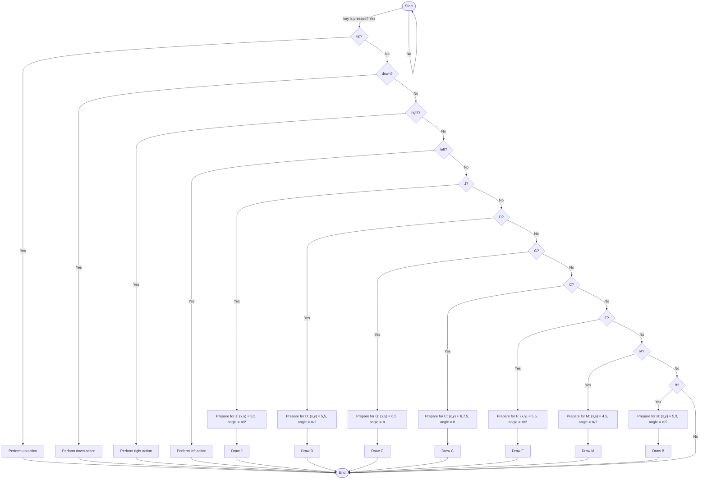

<picture>
    <source srcset="https://imgur.com/5bYAzsb.png" media="(prefers-color-scheme: dark)">
    <source srcset="https://imgur.com/Os03JoE.png" media="(prefers-color-scheme: light)">
    
</picture>

<h3>Curso de Robótica 2025-I</h3>

<h1>Laboratorio 01</h1>

<h2>Introduccion a Ros2 Humble - Turtlesim</h2>

<h4>Juan Jose Diaz Guerrero 
    Cristian Fabian Martinez Bohorquez</h4>

 

## Descripción del Proyecto

Este proyecto permite controlar una tortuga virtual del simulador `turtlesim` en ROS 2 para dibujar letras y moverse mediante comandos desde el teclado. El sistema permite que el usuario ordene al nodo que trace las letras **J**, **D**, **G**, **C**, **F**, **M** y **B**, así como controlar el movimiento directo usando las flechas del teclado (↑ ↓ ← →). El nodo está implementado en `rclpy` (Python) y hace uso de publicaciones y servicios disponibles en el entorno de `turtlesim`.

---

## Objetivos

- Aplicar los conceptos de servicios en ROS 2 usando `rclpy`.
- Utilizar `Twist` para enviar comandos de velocidad a la tortuga.
- Emplear los servicios `TeleportAbsolute` y `TeleportRelative` para ubicar la tortuga en posiciones y orientaciones específicas.
- Implementar control por teclado para activar el trazado de diferentes letras y movimientos libres.

---

## Procedimiento Realizado

Inicialmente se planteó realizar todas las trayectorias de las letras únicamente mediante comandos de velocidad (`/turtle1/cmd_vel`), pero se observó que esto no garantizaba una trayectoria consistente. Por ello, se decidió:

- Usar `/turtle1/teleport_absolute` para posicionar la tortuga con precisión antes de comenzar cada letra.
- Usar `/turtle1/teleport_relative` para crear segmentos lineales dentro de cada letra.
- Usar `cmd_vel` para curvas o movimientos suaves.
- Agregar control por teclado con flechas para mover la tortuga manualmente (adelante, atrás, girar izquierda y derecha).

---

## Funcionamiento General

### Inicialización:

- Se crea un nodo llamado `move_turtle` que publica en `/turtle1/cmd_vel`.
- Se definen clientes para los servicios:
  - `/clear`: borra los trazos en pantalla.
  - `/turtle1/teleport_absolute`: posiciona y orienta la tortuga en coordenadas absolutas.
  - `/turtle1/teleport_relative`: mueve la tortuga de manera relativa a su orientación actual.
- Se suscribe al tópico `/turtle1/pose` para acceder a su posición y orientación en tiempo real.

### ⌨Control por teclado:

- Se inicia un hilo que escucha continuamente las entradas del teclado.
- Al presionar:
  - `j`: se traza la letra **J**.
  - `d`: se traza la letra **D**.
  - `g`: se traza la letra **G**.
  - `c`: se traza la letra **C**.
  - `f`: se traza la letra **F**.
  - `m`: se traza la letra **M**.
  - `b`: se traza la letra **B**.
- Teclas de flechas:
  - `↑`: avanza recto durante 1 segundo.
  - `↓`: retrocede durante 1 segundo.
  - `→`: gira a la derecha sin avanzar.
  - `←`: gira a la izquierda sin avanzar.

---

## Desicion de diseno de las letras

- **Letra J**: Línea vertical por medio del servicio de teletransporte relativo y arco a la izquierda en la base por medio de movimientos linerares y angulares paralelos.
- **Letra D**: Línea recta vertical hacia abajo por medio del servicio de teletransporte relativo y arco semicircular derecho por medio de movimientos linerares y angulares paralelos.
- **Letra G**: Arco izquierdo por medio de movimientos linerares y angulares paralelos, línea vertical y línea horizontal final usando el servicio de teletransporte relativo.
- **Letra C**: Arco en sentido antihorario por medio de movimientos linerares y angulares paralelos.
- **Letra F**: Línea vertical con dos líneas horizontales utilizando en todas las lineas rectas el servicio de teletransporte relativo.
- **Letra M**: Línea vertical, dos diagonales y otra línea vertical utilizando el teletransporte relativo en cada una de estas.
- **Letra B**: Línea vertical usando el teletransporte relativo con dos arcos cerrando los bucles utilizando movimientos lineares y angulares paralelamente.

---

## Diagrama de Flujo

## Video Explicativo
https://youtu.be/O5baownskIE
